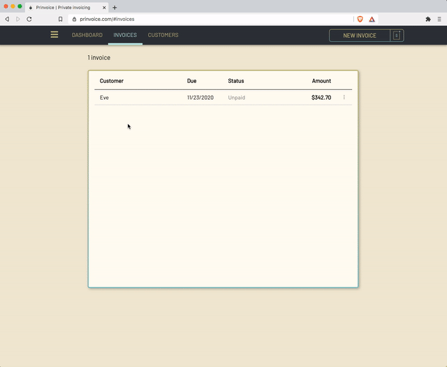
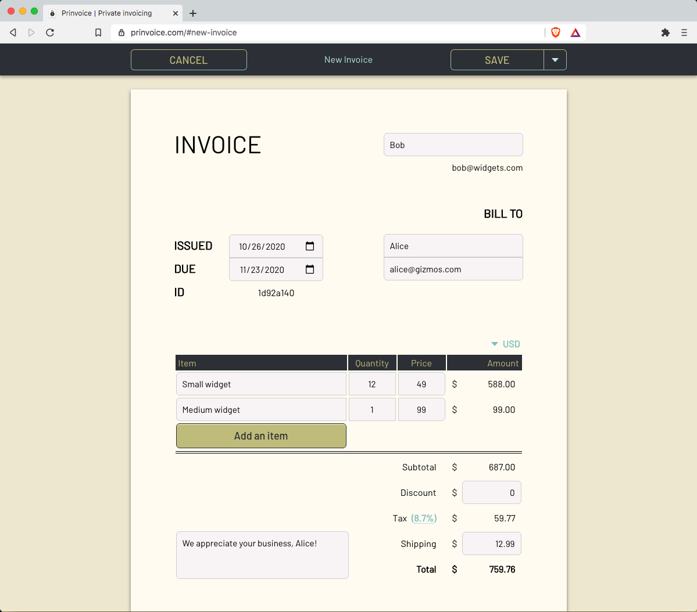
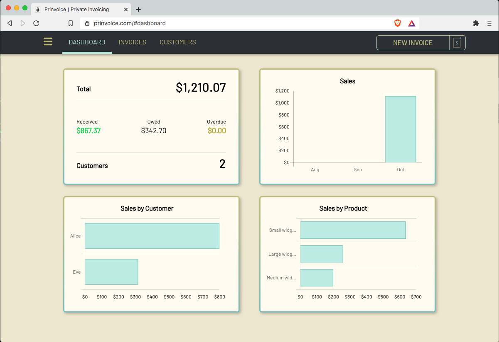
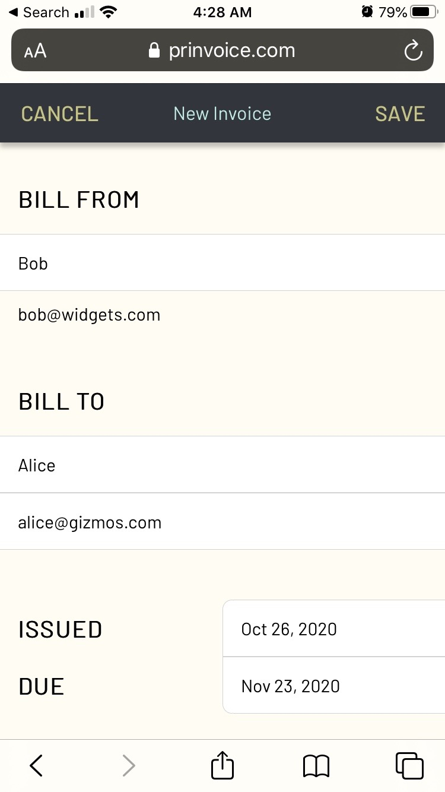
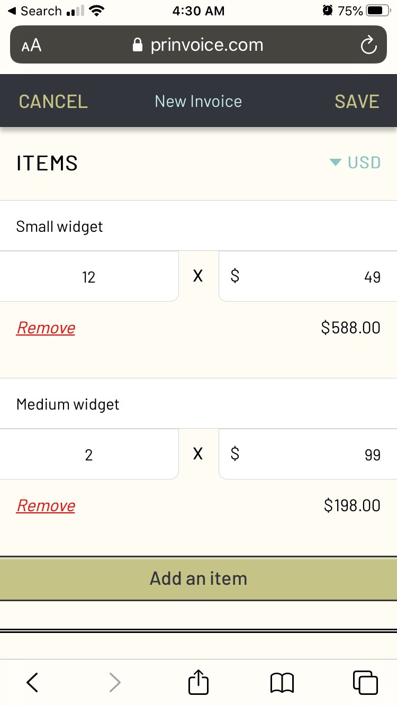
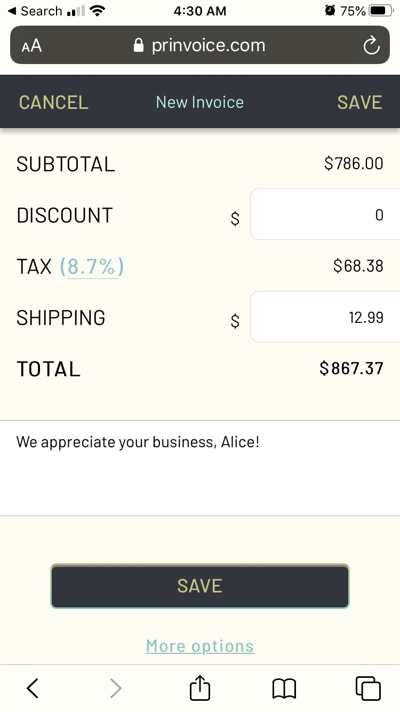
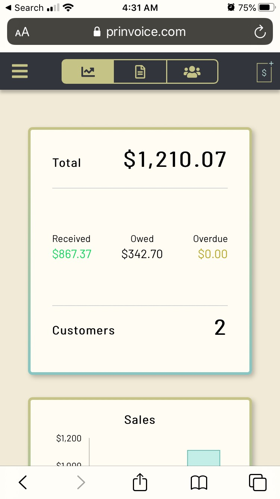
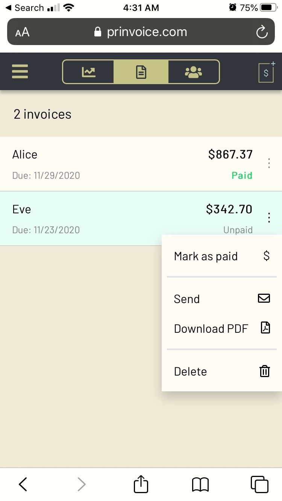

  

  <b>Create secure, private, beautiful invoices.</b>

## What is Prinvoice?

[Prinvoice](https://prinvoice.com) is a simple way to create and track invoices.

All invoices are encrypted locally using your password, before being sent to the server for storage (thanks to [Userbase](https://github.com/smallbets/userbase)).

You — and only you — have access to your own invoices.

## Screenshots

  

  

  

  

  
  
  

  
  

## License

This project is released under the [MIT License](LICENSE).
